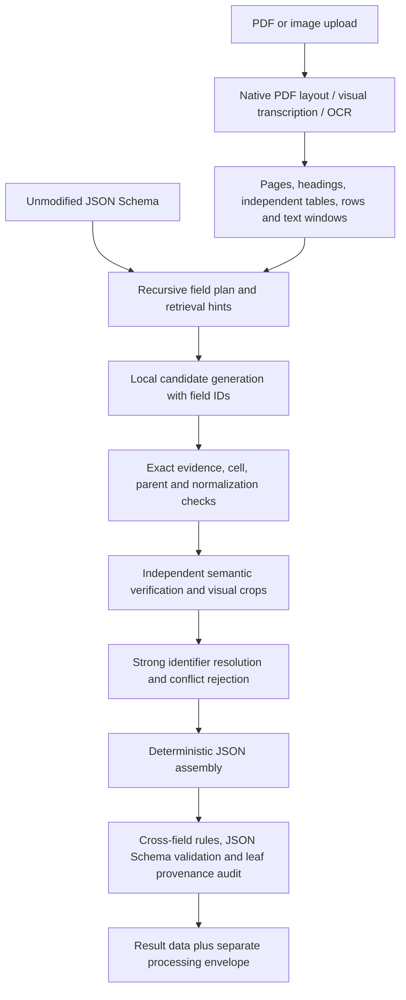

# Evidence-first extraction

The service now separates proposed values from facts admitted into the result. A model response alone cannot populate `result.data`.

## Root causes in the previous implementation

| Previous location | Failure mechanism | Replacement |
|---|---|---|
| `PdfTextService.extract` / `to_chunks` | Flattened tables and multi-column pages into strings; adjacent rows lost their source identity | `extraction/layout.py` retains cells, row/table IDs, coordinates, nearby headings, merged-cell references, word positions, and page relationships |
| `MistralDocumentService._extract_chunk` | Requested final JSON from a partial document | Candidate generation uses schema-derived field IDs and bounded evidence windows |
| `MistralDocumentService._merge_partials` | Another model merged partial answers without original source windows | Deterministic entity-aware assembly and explicit conflict rejection |
| `schema_service._normalize_schema` | Changed nullability and required fields, discarded constraints, rejected references/composition | Preserved input contract with `jsonschema`, the declared dialect, and format checking |
| `schema_service.exact_shape` | Type shaping was treated as validation | Full final validation; no coercion, fabricated defaults, or changed schema |
| `PartialExtraction.evidence` | Unrelated evidence list did not prove each value | Every accepted scalar has an exact source, raw value, entity identity, transformation, verification decision, and final JSON Pointer |
| `PdfTextService.apply_page_text` | Marked untouched/unread pages as read | Replaces only successfully transcribed pages and retains the original parse |

## Current flow



The pipeline searches every readable source window, including later pages. Retrieval scores are hints rather than a filter that can hide evidence. Oversized windows, unread pages and exhausted candidate budgets generate incomplete-search warnings. No absence claim is inferred from a retrieval miss.

For provider candidates, the application binds raw evidence to the selected existing cell or text window. A malformed copied quote cannot replace source content. The proposed scalar still must pass exact component/normalization checks, entity/column checks and independent semantic/visual verification. The audit records whether evidence was bound from a cell, exact span or full window.

Document-wide interpretation is a separate pass only when requested by the description or `x-extraction.scope`. Both generation and verification receive the complete readable source text plus structural inventory and page anchors. This pass abstains when the readable text exceeds its 64,000-character limit or pages remain unread. Unknown or ambiguous classifications remain unset; there is no built-in document-type enum.

## Schema and missing facts

`result.data` follows the supplied schema. The existing API envelope still carries job status and processing metadata separately. No provenance keys are inserted into user data automatically.

* Nullable fields may be null. Optional non-nullable fields may be omitted.
* Arrays may be empty only if the schema allows it.
* Required non-nullable facts cannot be invented. If evidence cannot satisfy the contract, the job has `failure_code=SCHEMA_UNSATISFIED`. `result.data` contains the retained partial data and `result.document.schema_valid` is false. This partial object is explicitly **not** a successful schema-valid response.
* JSON Schema defaults and examples are never used as extracted facts.
* References must be bundled within the supplied schema. The validator does not fetch arbitrary remote or local resources.
* Boolean schemas and non-object root instances are supported by the backend. The UI accepts these in its schema editor; tabular display is naturally best suited to objects.

## Normalization and relationships

Descriptions remain in the candidate and verification prompts, including ancestor descriptions. Deterministic checks support exact values, text encoding/whitespace repair, exact text components, numeric literals, printed numeric ordinals without index shifts, explicitly requested numeric/range components, boolean conditions, ISO date conversions with unambiguous source dates, and explicit mappings. Ambiguous localized numbers, units, dates and semantic ordinals are withheld.

For machine-readable instructions, any field may use these optional schema annotations:

```json
{
  "type": ["number", "null"],
  "description": "Recorded measurement, using the stated numeric format.",
  "x-extraction": {
    "thousandsSeparator": ",",
    "decimalSeparator": ".",
    "scale": 1
  }
}
```

Other supported annotations are `valueMap`, `dateFormat` (Python date format), `identity: true` on a strong string identifier, and `scope: "document"`. At the root, `x-extraction.relations` supports JSON Pointer `left` / `right` with `operator` equal to `le`, `ge`, `eq`, or `sum_eq`. Relationships are not invented from domain-specific field names.

Repeated source citations at the same location do not create new entities. Similar display labels alone never merge entities. `x-extraction.identity` can explicitly designate a strong string identifier. For object collections whose descriptions explicitly request unique entities, a separate schema-only interpretation pass may identify a matching identifier/code field from the descriptions. Shared currency/status codes and display labels are not identifiers. The selected schema rationale is recorded in the audit.

A focused item-schema pass re-reads the source rows, including repeated printed identifiers, before merging by the verified key. Anonymous fragments of a unique collection are withheld. If no unambiguous key is established, the unique collection remains unresolved. Repeated-entity review is bounded to 160 rows per collection and reports incomplete coverage when exceeded. Unresolved conflicting fields remain unset. Explicitly unique primitive arrays deduplicate equal values while preserving their separate citations.

For flat unique collections, a further source-consistency gate compares corresponding printed cells across tables with a verified identifier column and matching column headings. A fully textual immediate subheader can supply a missing heading beneath a merged title. This gate can withhold a disputed value even when the model omitted or rejected another occurrence; it never admits a new fact or reverses a verifier rejection. Equivalent authorized numeric formats remain comparable. Blank or ambiguous column roles and deeper parent hierarchies are not silently matched. Possible disagreements and their exact source cells are recorded in the audit. Sibling interpretations from a conflicting source cell are also withheld.

Described nested objects also receive a parent-association check on their component facts together. A state, country and postal code can each be real source text yet collectively belong to a supplier's office rather than the requested site. The parent gate rejects that transfer. Verification responses are constrained to the requested paths, source IDs and indices and are bound again in application code.

## Audit and observability

Every admitted scalar retains its final JSON Pointer, schema path, raw and candidate values, source page/section/table/column/row/bounding box, parser and evidence-binding method, original and resolved entity IDs, exact quote, normalization operation and signal score. Semantic and parent-verification reasons are retained. Rejected candidates retain their reasons internally. Ordinary application logs include counts and stages, not source contents.

SQLite persists the internal audit separately from the public job record. DynamoDB compresses audit JSON to reduce its item-size cost; the normal DynamoDB item limit still applies to exceptionally large results. Existing retention/deletion removes the job and its audit together.

Set `EXTRACTION_DEBUG=true` to additionally expose the decisions in `result.document.extraction_debug`. This is opt-in because raw values and quotes can be sensitive. The score is a conservative heuristic based on exact labels/columns, parser quality, visual agreement, normalization and repeated evidence. It is **not** a statistically calibrated probability of correctness.

Controls: `EXTRACTION_WINDOW_CHARS`, `EXTRACTION_MAX_CANDIDATES`, existing OCR policy, render DPI, and provider retry controls. Invalid or truncated candidate responses trigger smaller-context retries. Low confidence never relaxes the evidence checks.

`AI_REQUEST_TIMEOUT_SECONDS` (default 120) bounds each provider request, including visual transcription and OCR. Retries and multiple requests can make total job time longer.

Local candidate extraction uses `MISTRAL_TEXT_MODEL`; document-wide interpretation and independent semantic/visual verification use `MISTRAL_VERIFICATION_MODEL` (default `mistral-large-2512`). The evaluated small model accepted an exact but semantically wrong field mapping in the sample; the large verifier rejected the same candidate with the same evidence. This adds stronger-model inference cost and does not guarantee perfect decisions. Both model names are retained in live evaluation reports; the verification model is also in the API processing metadata. Override the verification setting explicitly to evaluate another model.

## Validation and limitations

Offline tests cover schema preservation, local references/composition, nullable and required fields, exact grounding, wrong columns, wrong parents, duplicate labels, conflicts, code shapes specified by descriptions, normalization, geometry, scanned-page visual agreement, image ingestion, audit persistence and provider failover. Paid live calls are deliberately not part of pytest.

`backend/verify_grounding.py` runs an explicit PDF and one or more schema files against the configured provider, caches local responses, and writes the data and complete audit under an output directory. These files contain source material and are ignored by git under `backend/live-results/`.

`backend/compare_extraction.py` generates adjacent ordered/returned-item tables and independently scores arbitrary schema fields against known answers for each explicitly selected model. `backend/audit_grounding.py` rechecks saved result values, exact sources, columns and schema constraints without a provider call. This mechanical audit deliberately makes no claim of semantic correctness.

Passing schema validation and an exact-quote check does not prove semantic correctness. Independent verification still uses a model and can fail. The example document exposed both malformed model output and an incorrect semantic interpretation despite exact quoted text. Production accuracy must be measured with manually checked references for the deployment's document distribution; no finite test establishes correctness for every arbitrary document and schema.

The extractor intentionally abstains on transformations it cannot reproduce, incomplete or ambiguous parent associations, visually unreadable evidence, and unresolved conflicts. This can reduce recall. In particular, deep cross-page hierarchies, unlabeled diagram relationships, complex multi-row headers, and arbitrary natural-language calculations may still require richer layout/entity models or explicit schema annotations. These are visible limitations, not evidence that the fact is absent.

The implementations follow the official [jsonschema validator documentation](https://python-jsonschema.readthedocs.io/en/stable/api/jsonschema/validators/) and [PyMuPDF table/geometry documentation](https://pymupdf.readthedocs.io/en/latest/page.html).
