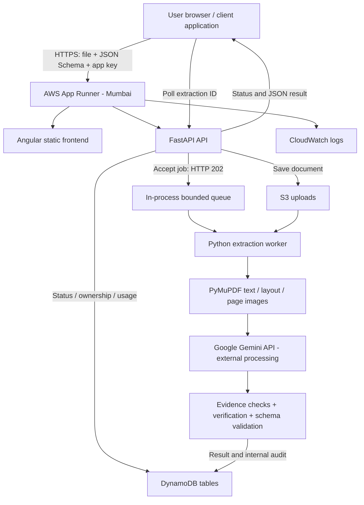

# PaperSignal: manager handover aur technical briefing

**Verified snapshot: 9 September 2026.** Yeh guide current code, live health endpoint, AWS read-only configuration checks, aur recorded release/evaluation reports par based hai. Jahan load test, billing account ya recovery verify nahi hui, wahan explicitly likha hai. Is document mein koi secret/API key nahi hai.

## 1. Meeting mein 30-second introduction

“PaperSignal ek document-to-JSON extraction application hai. User PDF ya image aur apna JSON Schema deta hai. System document ka text, tables aur zarurat par page images padhta hai, Gemini se requested facts nikalwata hai, phir source evidence aur schema ke against check karke structured JSON banata hai. Angular frontend aur Python FastAPI backend ek Docker container mein AWS App Runner, Mumbai par deployed hain. Files S3 mein aur job/results/access-key records DynamoDB mein hain. Infrastructure managed/serverless hai. Extraction accuracy ke checks implemented hain, lekin arbitrary complex documents ki 100% accuracy aur restart-safe background processing abhi guaranteed nahi hai.”

## 2. Current deployment: exactly kya chal raha hai?

| Item | Verified current value |
|---|---|
| Product / AWS service name | PaperSignal / `papersignal` |
| Live application | https://ydb2zmspyn.ap-south-1.awsapprunner.com |
| Hosting | AWS App Runner, Docker image deployment |
| Region | Asia Pacific (Mumbai), `ap-south-1` |
| Service status at inspection | `RUNNING`; live health HTTP 200 |
| Per-instance compute | 1 vCPU, 2 GB RAM |
| Frontend + backend | Same container and same website origin |
| Container registry | Amazon ECR, repository `papersignal-api` |
| Current image tag | `release-gemini-20260909` |
| Automatic deployment | Disabled; release is deployed manually |
| Source of current release | Base commit `4664096` plus Gemini working-tree changes; those changes are not all committed yet |
| AI provider | Google Gemini API, called externally from backend |
| Extraction, vision/OCR, verification model | `gemini-3.5-flash` for all three roles |
| Uploaded document storage | S3 bucket `papersignal-uploads-397332850029`, prefix `uploads/` |
| Job status/results/audit | DynamoDB table `papersignal-jobs` |
| App access-key records | DynamoDB table `papersignal-api-keys` |
| Monthly usage counters | DynamoDB table `papersignal-usage` |
| Logs | CloudWatch application and service log groups |
| Network | Public HTTPS endpoint, IPv4, default outbound connectivity |

Current service uses neither a customer-managed EC2 server nor Lambda functions. Older EC2, DuckDNS, Render or Mistral examples in repository/website documentation describe previous setups; use this snapshot and the latest release section for the current deployment.

## 3. Serverless hai ya nahi?

**Haan: managed serverless container hosting hai.** Hum virtual machines provision, OS administration ya load-balancer machines manually manage nahi karte. AWS App Runner application container ko host karta hai. Servers physically exist karte hain; AWS unko manage karta hai.

**Lambda-based application nahi hai.** Backend ek running FastAPI/Uvicorn application hai. S3 object storage aur DynamoDB on-demand database managed services hain. Running App Runner service minimum provisioned capacity rakhta hai, isliye idle cost zero assume nahi kar sakte.

**Background processing ka important distinction:** HTTP request asynchronously job accept karti hai, lekin worker queue current Python process ki memory mein hai. S3/DynamoDB mein data durable hone ke bawajood process restart ke baad accepted jobs automatically resume nahi hote. Managed hosting ko durable workflow guarantee samajhna galat hoga.

## 4. Technology stack aur har component ka kaam

| Layer | Technology | Purpose |
|---|---|---|
| Browser application | Angular 21, TypeScript 5.9, RxJS 7.8 | Upload, schema input, status polling, results, account and documentation UI |
| HTTP API | Python 3.11, FastAPI 0.116.1 | Authentication, upload validation, job/result endpoints |
| Application server | Uvicorn 0.35.0 | Container port 8000 par HTTP application run karta hai |
| Data models/settings | Pydantic 2.11.7, pydantic-settings 2.10.1 | Typed request/response/config validation |
| PDF processing | PyMuPDF 1.26.3 | Native text, page layout, table geometry, page rendering, image-to-PDF conversion |
| JSON validation | jsonschema 4.26.0 with format checks | Supplied schema aur final output validate karta hai |
| Current AI client | httpx 0.28.1 + Gemini REST API | Text/image requests, retries, errors and pacing |
| Optional previous provider | mistralai 1.9.10 adapter | Mistral explicitly select karne par usable; current production path Gemini hai |
| AWS client | boto3 1.43.89 | S3 and DynamoDB access |
| Background execution | Python ThreadPoolExecutor + bounded capacity | Same process mein extraction jobs chalata hai |
| Packaging | Docker, `python:3.11-slim`, Linux image | Repeatable runtime; non-root application user |
| Backend tests | pytest suite | Pipeline, schema, provider and API behavior checks |
| Frontend tests/build | Angular tooling + Vitest | UI behavior and production bundle checks |

Yeh custom application aur third-party foundation model integration hai. Apna LLM train/fine-tune nahi kiya gaya. Current pipeline mein vector database, embeddings, LangChain, SQS, Redis/Celery, Kubernetes, Amazon Bedrock ya Textract ki dependency nahi hai.

## 5. Architecture diagram

AWS Mumbai hosts our application and AWS storage. Gemini inference is performed by Google, not on our AWS container. Document text and selected/rendered page images leave AWS for model processing; end-to-end India-only data residency has not been established.

## 6. Ek document ka complete lifecycle

1. User PDF/image aur JSON Schema upload karta hai. Schema batata hai kaunse fields, types, required properties, enums aur descriptions chahiye.
2. Backend app access key, quota, batch size aur upload limits check karta hai. File naming/content/PDF readability checks hote hain. Supported image input PDF mein normalize hota hai.
3. File S3 mein save hoti hai; job record DynamoDB mein create hota hai. API accepted/rejected files aur extraction ID ke saath HTTP 202 return karti hai.
4. In-process worker accepted job pick karta hai. App/browser extraction ID se status poll karta hai.
5. PyMuPDF readable native text aur page layout nikalta hai. Tables ke row/column/cell aur available coordinates source associations preserve karte hain.
6. Scanned/unreadable pages ko Gemini visual transcription se read kiya ja sakta hai. Current Gemini path Mistral OCR service call nahi karta.
7. Schema descriptions aur source windows se AI candidate facts propose karta hai. Yeh final trusted output nahi hota.
8. Python evidence, source cell, permitted normalization, identity, parent relationship aur conflicts check karta hai. Separate AI verification request semantic/visual mapping check karti hai.
9. Accepted facts se Python final JSON assemble karta hai. User ke unmodified schema ke against final validation hoti hai.
10. Result, job status aur internal audit persist hote hain. Client completed/failed status aur available result read karta hai.
11. Source uploads seven-day S3 lifecycle ke eligible hote hain. Result records us lifecycle se delete nahi hote; explicit result deletion separate action hai.

Multiple documents ek batch mein submit ho sakte hain. Har document ka separate job/result hai; automatic cross-document business-record merging ka promise nahi hai.

## 7. JSON Schema simple words mein

Schema output ka contract hai: “projectName string hoga, bedrooms integer hoga, possessionDate date ya null ho sakta hai.” Clear descriptions model ko batati hain ki document mein kis meaning ka field dhoondhna hai.

System fixed real-estate template tak restricted nahi hai; field names/descriptions change karke other extraction tasks attempt kar sakte hain. Lekin schema support aur extraction accuracy alag cheezein hain: validator complex schema validate kar sakta hai, par model har complex relationship correctly infer karega, yeh guaranteed nahi hai.

- Nullable missing field: schema permit kare to `null`.
- Optional non-nullable unsupported field: omit ho sakta hai.
- Required fact absent/unverified: `SCHEMA_UNSATISFIED` ho sakta hai; invalid partial result ko valid complete answer nahi dikhana chahiye.
- Empty array tabhi valid hai jab schema allow kare.
- Type, enum, required fields, extra properties aur format checks applicable schema ke according hote hain.
- External schema references automatically internet se fetch karne ka contract nahi hai; bundled local references use hote hain.

Missing value ka meaning “source se reliably extract nahi hua” hai. Yeh automatically “document mein fact absent hai” nahi hota.

## 8. AI quality controls: kya protect karte hain?

| Control | Kis problem ko reduce karta hai |
|---|---|
| Per-scalar source evidence | Source mein na likha number/string invent hona |
| Row/column/cell associations | Adjacent table ya wrong row ka value uthana |
| Schema-described semantic verification | Company address ko project address samajhna jaise meaning errors |
| Parent verification | Sahi fact ko wrong object/entity ke neeche attach karna |
| Schema-derived identifiers | Duplicate/anonymous objects aur wrong entity merging |
| Deterministic normalization | Undeclared unit/date/decimal conversion |
| Repeated-source disagreement checks | Same identifier ke conflicting printed values silently accept hona |
| Deterministic final assembly | Raw model JSON ko directly trusted response banana |
| Full final schema validation | Syntactically valid JSON ka business schema violate karna |

**Separate verification call ka matlab separate model nahi:** production mein candidate aur verifier dono `gemini-3.5-flash` hain. Request alag hai; errors correlated ho sakte hain. Model settings separately configurable hain.

Retrieval source text/layout windows aur lexical hints par based hai; vector RAG nahi. “Grounded” yahan uploaded document evidence ko refer karta hai; Google Search grounding enabled hone ka claim nahi hai. Confidence score heuristic signal hai, calibrated probability nahi. Internal audit available hai, lekin full source citations/raw debug ordinary public response mein automatically expose nahi hote.

## 9. Testing aur accuracy: manager ko kya number bolna hai?

| Evaluation | Recorded result | Correct interpretation |
|---|---|---|
| Current backend offline suite | 158 tests passed | Implementation scenarios verified; 158 live customer documents nahi |
| Frontend suite + production build | 36 tests passed; build passed on unchanged frontend revision | UI regression/build verification |
| Gemini native generated PDF | 8/8 expected facts, no wrong/missing facts, absent date null | Small controlled integration test |
| Gemini scanned generated PDF | 8/8 expected facts, exact expected JSON | Real visual transcription/extraction/verification on controlled scan |
| Gemini AWS production smoke | 3/3 expected facts, absent fax null; schema valid | Deployed end-to-end path worked |
| Earlier 41-page real brochure, Mistral | Basics 2, Amenities 10, Inventory 55 distinct populated scalar fields | Earlier provider evaluation; completeness was limited |
| Earlier brochure inventory selected areas | 33 returned measurements manually compared, 0 mismatches | Selected-field check, not overall document accuracy |

Native Gemini verification run reused the exact-request candidate response; verification itself used a real Gemini call. Scanned Gemini run used real transcription, extraction and image verification. Earlier brochure final replay reused recorded provider responses, so replay timings are not live processing latency.

**The full 41-page brochure with all three supplied schemas has not been re-benchmarked on Gemini.** Do not present Mistral brochure scores as Gemini scores or 8/8 fixture success as universal 100% accuracy.

Observed failures came from three places: code associations/validation, model semantic interpretation, and contradictions in the PDF. For example, the earlier brochure prints conflicting configurations for the same type codes; withholding disputed values is expected. Project name, some amenities and cross-page tower/floor relationships remained incomplete.

For a defensible quality percentage, next benchmark needs independent expected answers across representative documents and separate measurements of wrong facts, correct facts, missing facts, schema success, latency and cost. A mostly-null schema-valid JSON is not a high-accuracy result.

## 10. Limits, pacing aur capacity

| Limit | Current setting | Meaning |
|---|---:|---|
| File size | 200 MB | Application limit; full-size upload through the hosting edge has not been load-tested |
| PDF pages | 50 | Per document |
| Files per batch | 10 | Per submission |
| Total batch size | 500 MB | Application limit, not a tested network/edge guarantee |
| Worker count | 1 per instance | One extraction job executes at a time on that instance |
| Queue capacity | 100 per process | Running + waiting jobs; not 100 simultaneous extractions |
| Gemini pacing | 15 seconds minimum between request starts | Approximately 4 request starts/minute/process, often slower with responses/retries |
| App key default rate limit | 60 requests/minute | Individual issued keys may override; check `/api/v1/account` |
| App key default monthly quota | 1,000 documents | App quota, separate from Google quota; keys may override |
| AI request timeout | 120 seconds default | Per model request, not total document completion deadline |
| Transient retry budget | Up to 3 retries | Initial attempt plus retries; server-directed waiting can add time |
| App Runner min / max instances | 1 / 25 | Configured platform scaling bounds; 25 are not continuously running |
| App Runner max concurrency | 100 | Incoming HTTP-request scaling setting, not PDF-worker concurrency |

**Pacing:** requests ke beech gap rakhna. Agar six AI calls needed hain, first aur sixth start ke beech at least 75 seconds ka spacing hoga; actual work/retries isse aur time badha sakte hain. Four AI requests/minute ka matlab four PDFs/minute nahi.

Google limits requests, tokens aur daily usage par apply ho sakte hain. Key replace/delete karne se project quota reset assume nahi karna chahiye. Shared pacer current process tak limited hai; multiple instances/other tools same Google project quota share karte hain. App rate limiter bhi distributed nahi hai.

App Runner HTTP demand ke according scale karta hai; in-memory PDF backlog uska direct scaling signal nahi hai. “25 instances configured” se reliable 25-worker orchestration, 1,000 concurrent users, ya guaranteed throughput prove nahi hota. Representative load testing and durable workers are needed before capacity commitments.

## 11. Security, keys aur data handling

| Credential | Purpose | Where used |
|---|---|---|
| PaperSignal app access key | Client ko extraction API access | Browser/client sends header; database stores SHA-256 hash |
| Gemini API key | Backend ko Google model access | Backend environment only; request header to Google |
| AWS credentials / IAM role | Deploy resources or access S3/DynamoDB | Operator AWS tooling; running app uses instance role |
| Admin token | App access key issue karna | Backend validates `X-Admin-Token` |

App key `X-API-Key` or Bearer authorization se accepted hai. Records calling key ke owner ID se scoped hain. Raw issued key one-time return hoti hai; database se original recover nahi hoti. Key replacement currently old jobs ka ownership automatically migrate nahi karta.

Frontend entered app access key browser `localStorage` mein remember karta hai. This is different from the Gemini key, which is not bundled into frontend code. Browser security remains relevant because page scripts can access localStorage.

Current controls: HTTPS public endpoint; S3 all four public-access blocks enabled; S3 default AES256 server-side encryption; non-root container user; hashed app keys; backend-only provider secret; IAM instance-role access to AWS data. Current App Runner role is `PaperSignalAppRunnerTask`.

Current provider/admin secrets are environment configuration, not a configured Secrets Manager reference. This inspection did not audit full IAM least privilege, perform penetration testing, or certify compliance. SSO, per-user RBAC and enterprise identity lifecycle are not implemented as a complete product flow. Input checks are not malware scanning. Treating document instructions as untrusted helps, but is not proof against every prompt-injection attack.

**Google data policy:** For unpaid services, Google's terms describe product-improvement use and possible human review, and say not to submit confidential, sensitive or personal information. Paid API access is tied to an actively billed Cloud project; its terms exclude prompts/responses from product improvement, with limited abuse-monitoring retention. Actual project billing status has not been verified here. Do not claim “Google never uses our data” or “all processing stays in Mumbai.” [Official Gemini terms](https://ai.google.dev/gemini-api/terms).

## 12. Retention, deletion, backup aur monitoring

| Area | Verified state | Operational implication |
|---|---|---|
| S3 uploads | Enabled lifecycle expiry after 7 days under `uploads/` | Eligible objects expire asynchronously; exact deletion at hour 168 is not guaranteed |
| S3 versioning | Not enabled | No configured object version history |
| DynamoDB tables | All three on-demand (`PAY_PER_REQUEST`), active | Request/storage-based billing |
| DynamoDB TTL | Disabled on all three tables | Results, audits, keys and usage do not automatically expire through TTL |
| DynamoDB point-in-time recovery | Disabled on all three tables | Do not claim configured PITR restore protection |
| DynamoDB deletion protection | Disabled on all three tables | Table deletion protection not enabled |
| CloudWatch logs | Application and service groups exist; no retention period configured | No automatic age-based log expiry configured |
| Matching CloudWatch metric alarms | No PaperSignal-matching metric alarm found in inspected region | Logging exists; proactive alerting is not established by this inspection |
| HTTP health check | `/api/health`, 10-second interval, 5-second timeout | Process health is checked; provider success and extraction quality are separate |

Seven-day S3 deletion does not remove facts already saved in DynamoDB or copies submitted to Google. Database audit content can also retain extracted/source text. Account-level backups or external monitoring were not comprehensively audited; do not infer their presence from managed-service redundancy.

The DELETE extraction endpoint removes corresponding app records and uploaded files, and rejects actively processing jobs. Queued deletion should not be treated as reliable worker cancellation. The legacy `cleanup.py` instantiates local SQLite/disk stores and is not a complete production S3/DynamoDB retention scheduler.

## 13. Cost: free model ka matlab free application nahi

Mumbai's official App Runner price list currently gives **$0.007448/GB-hour memory** and **$0.068096/vCPU-hour active compute**. One 2-GB provisioned instance over an assumed 730-hour month gives approximately **$10.87 memory baseline**. With one vCPU billed active for 100 hours, that becomes approximately **$17.68**; active for all 730 hours, approximately **$60.58**. These are one-instance infrastructure illustrations, not the actual bill; extra instances, storage, requests, logs, transfer, taxes and credits change totals. [AWS Mumbai price list](https://pricing.us-east-1.amazonaws.com/offers/v1.0/aws/AWSAppRunner/current/ap-south-1/index.json), [billing explanation](https://aws.amazon.com/apprunner/pricing/).

S3, DynamoDB, ECR and CloudWatch are additional usage-based components. AI cost depends on model, consumed tokens and the Google project's actual billing/quota. Free availability and per-document cost are not verified account facts. Track model calls, tokens, retries and document complexity to calculate cost per successful extraction.

## 14. API integration: manager/developer quick reference

| Method / path | Purpose | Access |
|---|---|---|
| `GET /api/health` | Service/config health and limits | Public |
| `GET /api/docs` | Interactive Swagger API docs | Public documentation |
| `GET /api/openapi.json` | Machine-readable API contract | Public documentation |
| `POST /api/v1/extractions` | Upload batch + schema; returns 202 | App key |
| `GET /api/v1/extractions/{extraction_id}` | Poll per-document status/results | Owning app key |
| `DELETE /api/v1/extractions/{extraction_id}` | Delete extraction data | Owning app key |
| `GET /api/v1/account` | Actual key limits/monthly usage | App key |
| `POST /api/v1/keys` | Create client access key | Admin token |

Upload uses multipart fields `files`, `output_template` (JSON Schema text), and `ocr_mode` (`auto`, `always`, `never`). Completed extracted business data is in `result.data`. Read job status and schema-validity/error fields before consuming it.

Integrate by uploading once, saving extraction ID, then polling until terminal status. There is no upload idempotency key or completion webhook contract implemented. Blind retry after a lost upload response can create duplicate work. A polling timeout does not prove the job has stopped. Batch response may include rejected files even when other files were accepted.

The same-origin deployed frontend works without cross-origin setup. A new external browser frontend needs its origin configured in CORS. Server-to-server integrations are not governed by browser CORS.

## 15. Troubleshooting: kis layer mein issue hai?

| Symptom | Likely layer / next check |
|---|---|
| Site/health unavailable | App Runner status, current deployment and service logs |
| App endpoint HTTP 401 | Missing/wrong/revoked PaperSignal app key; not automatically a Gemini issue |
| `AI_AUTH_FAILED` inside job | Backend provider key/model access; healthy website can still have this failure |
| HTTP 402 | App key monthly document quota |
| HTTP 429 / rejected job | Inspect response: app request limiter, queue capacity, or provider quota are different causes |
| `AI_RATE_LIMITED` | Google project rate/token/day limits and retry delay |
| Provider HTTP 503 / unavailable | Provider load/availability; not automatically insufficient model intelligence |
| HTTP 413 | Upload/batch size or upstream limit |
| HTTP 422 | Invalid request/schema/file constraints; inspect detail |
| `SCHEMA_UNSATISFIED` | Required supported facts unavailable, rejected or incompatible with schema |
| Result incomplete/null | Source absence, conflict, scan quality, missed candidate, conservative validation or semantic error |
| Job stuck after release/restart | In-process worker lost; automatic durable recovery absent |
| Queue grows, app still responds | One worker plus many model calls/pacing; HTTP health is not worker backlog health |

Use extraction ID, failure stage, failure code and sanitized logs for investigation. Avoid copying API keys or whole confidential documents into general support messages. Healthy `/api/health` only proves service responsiveness/configuration presence, not a successful live provider call or correct answer.

## 16. Deployment, rollback aur ownership

Current release flow: verify backend/tests and frontend build, package frontend into `backend/web`, build Linux Docker image, push a versioned tag to ECR, update App Runner image configuration while preserving environment/roles/storage settings, wait for release success, then run public/authenticated smoke checks.

Auto-deploy is disabled. Current image is pinned to `release-gemini-20260909`; changing `latest` or starting deployment without changing the configured image tag does not switch to a new version. Source control should capture the current Gemini changes before a reproducible next release. The existing deployment artifact identifies the running image even though source changes remain uncommitted.

Older Mistral image is retained, but rolling back to it requires compatible provider settings and a valid Mistral credential; the previous credential was deleted. A release can interrupt in-memory jobs, so accepted workload needs an explicit operational plan until durable processing is implemented.

Responsibility: AWS manages hosting infrastructure; application team manages code, dependencies, schemas, keys, app limits, provider usage and correctness; Google serves model inference; product/business owner defines required accuracy and review expectations. No measured application SLA, RTO or RPO has been established by these tests.

## 17. Known gaps aur priority order

1. **Reliable execution:** durable queue plus separate workers, restart recovery, retry/dead-letter handling and upload idempotency. Queue backlog should drive worker scaling.
2. **Quality evidence:** rerun real brochure schemas on Gemini; add representative invoices, tables, scans and nested structures with independently labelled answers. Track precision and recall separately.
3. **Shared limits:** distributed provider pacing and app rate limits; atomic quota reservation/accounting before using usage counters as exact billing.
4. **Data governance:** agree result/audit/log retention, paid-provider privacy needs, backup/restore procedures and regional requirements; enable appropriate protections after requirements are decided.
5. **Operational visibility:** queue age, stuck jobs, provider failures, extraction quality and cost dashboards/alerts; test recovery and realistic load.
6. **Release discipline:** commit provider changes, automate reproducible build/deploy/smoke/rollback, and refresh old embedded docs to current AWS/Gemini facts.
7. **Enterprise access:** managed secrets/rotation, user/tenant roles and SSO if required; audit browser-key handling and IAM permissions.

These are recommendations, not features already implemented. The application is deployed and has passed limited end-to-end tests; large-scale enterprise readiness has not been demonstrated.

## 18. Manager FAQ: ready answers

**Q: Iska business benefit kya hai?** Manual document reading/data entry ko reduce karna aur downstream systems ko schema-shaped JSON dena. Time saved/ROI ka actual baseline comparison abhi measure karna hai.

**Q: Kya sirf real-estate PDFs handle karta hai?** Nahi, schema-driven design other domains ke liye bhi usable hai. Har document family par accuracy evaluate karni hogi.

**Q: Kya scanned PDF bhi chalegi?** Haan, visual transcription path implemented aur controlled scanned fixture tested hai. Poor resolution, handwriting aur complex diagrams par broad benchmark nahi hua.

**Q: AI AWS par hosted hai?** Application AWS par hai; Gemini model Google API par externally runs. Our container does not host model weights or need a model-serving GPU.

**Q: Mistral se Gemini kyun?** Previous key/quota issues ke baad provider changed. Tested Gemini 3.5 completed native/scanned pipeline fixtures. This is an integration/availability choice, not proof it is universally the best model.

**Q: Kya system 100% accurate hai?** Nahi. Small fixtures passed exactly, but arbitrary documents can have missing, wrong or conflicting facts. Evidence checks reduce errors; human-reviewed benchmarks define usable quality.

**Q: AI galat ho to code pakad lega?** Some errors source/schema/cell checks catch karte hain. Semantic mistakes can survive even verification, especially with the same model used twice.

**Q: Null kyun aata hai?** Evidence insufficient, conflicting, not proposed, or rejected ho sakta hai. Null automatically source absence prove nahi karta.

**Q: Kya answer milne ke liye schema badalta hai?** Final validation supplied schema ko preserve karti hai. Missing required unsupported data se failure possible hai; schema silently relax nahi karna chahiye.

**Q: Kitne users/documents handle karega?** Current settings known hain, measured production capacity unknown hai. One worker per instance and provider quotas important bottlenecks hain; load test ke bina fixed user-count promise nahi.

**Q: Slow kyun hai?** Parsing, multiple AI calls, image reading, verification, 15-second pacing and quota retries add time. Browser response acceptance aur extraction completion alag timings hain.

**Q: Unlimited free hai?** Nahi. AI quotas/account terms apply; AWS hosting/storage/logging costs separate hain.

**Q: New Google key se rate limit fix ho jayegi?** Same project quota remains relevant. Pacing helps bursts; token/day limit ke liye workload or eligible account tier address karna padta hai.

**Q: Data private aur India-only hai?** AWS files private bucket mein Mumbai region mein hain. Processing Google ko jati hai; India-only inference and provider billing/data treatment are not established here.

**Q: Saara data seven days mein delete hota hai?** Nahi. S3 uploads ka seven-day expiry rule hai; DynamoDB results/audits aur logs ki automatic expiry configured nahi hai.

**Q: Restart par data lose hota hai?** Persisted S3/DynamoDB data remains separate from container, but in-memory execution can stop and jobs may remain unfinished. Automatic resume absent hai.

**Q: Disaster recovery ready hai?** Tested recovery objective nahi hai. DynamoDB PITR disabled, S3 versioning not enabled; existing service durability is not a tested disaster-recovery plan.

**Q: Kya custom training hua hai?** Nahi. Pretrained model ko schema/source prompts dete hain; code validates and assembles results.

**Q: Kya vector database/RAG use hota hai?** Vector DB/embeddings nahi. Uploaded source evidence aur lexical/layout retrieval use hoti hai.

**Q: Integrate kaise karenge?** App access key ke saath upload endpoint, extraction ID store, status poll, validated `result.data` consume. Same key se result ownership maintained hota hai.

**Q: API key bhool gaye to?** Stored hash se raw app key recover nahi hoti; authorized replacement issue karna hota hai. Old result ownership migration separately plan karni hogi.

**Q: Next investment kya hona chahiye?** Durable job execution, Gemini real-document benchmark, shared quota control, and agreed data retention/monitoring. Bigger model alone all reliability or source-quality problems solve nahi karta.

## 19. Evidence and further reading

- [Current Gemini configuration and test scope](GEMINI_PROVIDER.md)
- [Dated release identity and production smoke checks](DEPLOYMENT_2026-09-09.md) — latest Gemini section is current.
- [Pipeline implementation design](EXTRACTION_PIPELINE.md)
- [Earlier Mistral document evaluation and unresolved recall](EXTRACTION_VALIDATION.md)
- [Live API documentation](https://ydb2zmspyn.ap-south-1.awsapprunner.com/api/docs)
- [AWS App Runner overview](https://aws.amazon.com/apprunner/)
- [Gemini rate limits](https://ai.google.dev/gemini-api/docs/rate-limits)

Verified AWS calls covered service/image/network/health configuration, autoscaling bounds, bucket lifecycle/public access/encryption/versioning, DynamoDB billing/TTL/PITR/deletion protection, log retention and matching regional metric alarms. No infrastructure was changed for this briefing. Historical test results were read from release/evaluation artifacts; the complete test suite was not rerun for this documentation-only task.
